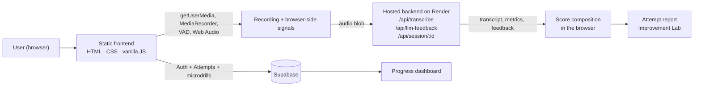

<div align="center">


# BOL — Break Your Stage Fear

**Record a short speaking attempt. See what your delivery is doing. Practice the parts that need work.**

**Speak → Analyze → Improve → Repeat**

BOL is a browser-based speaking-practice platform for students and early-career professionals preparing for interviews, vivas, presentations and project explanations.

Public speaking anxiety is more common than it looks: roughly 3 in 4 people are reported to experience some level of fear when speaking in public. For students, that fear can show up as hesitation, stammering, rushed answers, or difficulty explaining what they already know.

BOL addresses the gap between knowing the answer and communicating it under pressure. It records a 30–60 second speaking attempt, measures delivery signals such as pace, pauses, vocal stability and filler words, identifies the biggest weaknesses, and turns them into short, targeted drills. Every logged-in attempt is stored so users can see how their performance changes over time.

	
**Problem--	Knowing the answer is not the same as delivering it under pressure. Speaking is difficult to practice alone, while useful feedback is often subjective or unavailable**
**Insight--	Coding improves through repeated practice and measurable feedback. Speaking can follow the same loop when delivery is measured.**
**Solution--	A repeatable practice loop: Record → Measure → Understand → Practice → Record again.**
**Product-- A browser-based platform with speaking practice, performance analysis, targeted drills, and progress tracking, backed by Supabase for accounts/history and a hosted API for transcription and feedback.**

## Contents

1. [The problem](#the-problem)
2. [The solution: a practice loop](#the-solution-a-practice-loop)
3. [Product preview](#product-preview)
4. [What is built](#what-is-built)
5. [How it works](#how-it-works)
6. [Architecture](#architecture)
7. [Tech stack](#tech-stack)
8. [Project structure](#project-structure)
9. [User flow](#user-flow)
10. [Getting started](#getting-started)
11. [Configuration](#configuration)
12. [Deployment](#deployment)
13. [Why this is different](#why-this-is-different)
14. [Limitations and known issues](#limitations-and-known-issues)
15. [Roadmap](#roadmap)
16. [Hackathon context](#hackathon-context)
17. [Team](#team)
18. [Contributing](#contributing)
19. [License](#license)

---
## The problem

### 77% of people are afraid of speaking in public. For students, that fear can show up exactly when communication matters most.

A student can understand a concept and still freeze while explaining it in a viva. A candidate can have the right skills and still lose the thread in an interview. Under pressure, delivery changes: pace drifts, pauses stretch, sentences break, and filler words creep in.

The problem isn't always a lack of knowledge. **It's the gap between knowing what to say and being able to communicate it clearly under pressure.**

Practicing this is harder than practicing code:

- **It's hard to repeat privately.** Most people rehearse in their head, which doesn't reproduce the pressure of actually speaking.
- **Feedback depends on someone else.** A friend, mentor, or teacher has to be available, and their feedback is often subjective.
- **Improvement is hard to measure.** Without consistent signals, it's difficult to know whether your pace, pauses, delivery, or clarity are actually getting better.

BOL's aim is to make speaking practice **repeatable, measurable, and actionable**:

**Record → Measure → Understand → Practice → Repeat.**
## The solution: a repeatable speaking practice loop

BOL turns speaking practice into a **repeatable, measurable loop** instead of a one-time score.

| Stage | What happens in BOL |
|---|---|
| **Speak** | Record a short speaking attempt directly in the browser. Voice-activity detection verifies that genuine speech was captured before submission. |
| **Analyze** | BOL analyzes measurable delivery signals such as **speaking pace, pauses, loudness stability, opening energy, confidence trajectory, and transcript-based signals**, then combines them into a **0–100 confidence score**. |
| **Improve** | The Improvement Lab identifies the **three highest-impact issues** from the attempt and converts them into short, focused micro-drills with measurable targets. |
| **Repeat** | Record again and see whether your performance improves. Logged-in users can track **confidence score, WPM, pauses, and duration** across sessions from the progress dashboard. |

### The core idea

**Don't just tell someone they need to communicate better.  
Show them what changed, what to fix, and what to practice next.**

**Speak → Analyze → Improve → Repeat**

## Product Preview

**Turn 60 seconds of speaking into a measurable step toward speaking with confidence.**

BOL helps users practice, understand exactly what is holding them back, and improve through focused feedback, one session at a time.

### 🎙️ Practice

Record a 30–60 second speaking attempt with a live waveform and timer, designed to feel like a real speaking situation.

### 📊 Analyze

Get a confidence score with clear insights into speech rate, pauses, and speaking patterns.

### 🎯 Improve

Identify your biggest improvement areas and get actionable guidance for your next attempt.

### 📈 Track Progress

Track every session, your average confidence, best score, practice time, and progress over time.

> **Practice → Analyze → Improve → Repeat**
> BOL transforms speaking practice from guesswork into a measurable improvement loop.

*A complete product walkthrough is available in `demoreport.html`.*


## What is built

Each item below was checked against the code in this repository.

| Area | What it does | Status |
|---|---|---|
| **Speaking practice** | Browser recording via `MediaRecorder`, live waveform and timer, energy-based voice-activity detection (`VAD/vad.js`), minimum 5 seconds of detected speech before submission. Works without an account. | Implemented |
| **Confidence score** | Composite score, shown 30–95 out of 100. Up to 60 points come from signals returned by the backend (speech rate, sentence completion, lexical confidence, silence analysis, filler words); up to 40 come from browser-side audio signals (opening energy, loudness stability, confidence trajectory over three segments). | Implemented |
| **Pause classification** | Pauses are typed (rhetorical, cognitive, panic, micro) using duration, energy drop and recovery slope, and feed both the score and the trajectory label ("Improved steadily", "Lost momentum mid-way", etc.). | Implemented |
| **Attempt report** | Shown right after submission: score ring, active vs. total duration, WPM, pause count, confidence timeline, audio playback, and written feedback items. | Implemented |
| **Improvement Lab** | Top three focus areas from the attempt, micro drills mapped to metrics (pace, filler words, delivery flow / pauses, vocal clarity, word repetition), a timed drill recorder with auto-submit, before/after distance to target, two consecutive passes to complete a drill, a "Take Help" prompt bank, and a before/after score comparison. | Implemented |
| **Practice streak** | Day streak shown in the Improvement Lab, stored in browser `localStorage`. | Implemented |
| **Authentication** | Email + password sign-up, log-in and log-out through Supabase Auth. Guests can practice; log-in is prompted when they try to save progress. | Implemented |
| **Progress dashboard** | Total sessions, average confidence, best score, total practice time, a Chart.js trend chart (last 10 / 20 / 30 / all) and a session history table. Guests see a locked view. | Implemented |
| **Drill persistence** | Completed drills are upserted to a Supabase `microdrills` table for logged-in users. | Implemented |
| **Per-session detail page** (`session.html`) | Ownership check works, but the page itself is a "Coming Soon" placeholder. | Placeholder |
| **Daily goals** | Mentioned in UI copy only. No goal-setting logic exists. | Not implemented |

> **On AI usage.** The browser does not call any LLM or speech API directly. Transcription and written feedback are produced by a hosted backend (see [Architecture](#architecture)). Everything else — recording, VAD, pause classification, score composition, drills — runs in the browser.

## How it works

```text
User
  ↓  speaks (mic permission → MediaRecorder + energy-based VAD)
Browser
  ↓  measures energy, pauses, opening, loudness stability, trajectory
  ↓  uploads the audio blob
Hosted backend  /api/transcribe
  ↓  returns transcript + speech rate + fillers + silence / sentence / lexical analysis
Hosted backend  /api/llm-feedback
  ↓  returns a list of issues ("mistakes") with titles, descriptions, drill configs
Browser
  ↓  combines backend and browser signals into the confidence score
  ↓  renders the attempt report; saves numeric metrics to Supabase (if logged in)
Improvement Lab  (improvement.html?session=…)
  ↓  focus areas + micro drills; each drill attempt is re-analysed the same way
Dashboard
     score / WPM / pauses / duration per attempt, trend over time
```

## Architecture



| Component | Responsibility in the current implementation |
|---|---|
| **Static frontend** | All pages and logic: recording, VAD, pause classification, score composition, result screen, drills, dashboard. No build step. |
| **Hosted backend (Render)** | Called from `BOL.html` and `improvement.js` at `/api/transcribe`, `/api/llm-feedback` and `/api/session/:id`. Returns transcript, speech-rate, filler and silence analysis, and the feedback list that drives the Improvement Lab. **Its source code is not in this repository.** |
| **Supabase** | Email/password auth; `Attempts` table (score, WPM, pauses, durations per attempt); `microdrills` table (completed drills). The frontend does not upload audio to Supabase. |
| **Chart.js** | Trend chart on the dashboard. |

## Tech stack

| Layer | Technology | Purpose |
|---|---|---|
| Markup / styling | HTML5, CSS3 (`assets/css/theme.css` plus per-page CSS) | All pages and the shared theme |
| Logic | Vanilla JavaScript (ES modules for VAD) | Recording, scoring, drills, auth UI, dashboard |
| Browser APIs | `MediaDevices.getUserMedia`, `MediaRecorder`, Web Audio API (`AudioContext`, `AnalyserNode`) | Capture, waveform, energy and pause signals |
| Auth & database | Supabase (`supabase-js` 2.x via jsDelivr) | Accounts, attempt history, drill completion |
| Charts | Chart.js 4.4.0 via jsDelivr | Dashboard trend chart |
| Backend | Hosted service on Render (separate codebase) | Transcription and feedback endpoints |
| Fonts | Google Fonts | Typography |

## Project structure

```text
BOL-Break-Your-Stage-Fear/
├── index.html              # Landing + login / sign-up
├── BOL.html                # Practice Lab: recording, scoring, attempt report
├── dashboard.html / .css / .js     # Progress dashboard
├── improvement.html / .css / .js   # Improvement Lab (focus areas, micro drills)
├── session.html            # Per-session insights (placeholder page)
├── BOLauth.js              # Supabase client + login/sign-up modal + guest handling
├── login.js / login.css    # Login / sign-up logic for index.html
├── auth-modal.css
├── result-screen-1.css     # Styling for the attempt report
├── VAD/
│   └── vad.js              # Energy-based voice-activity detection (ES module)
├── assets/
│   ├── css/theme.css       # Shared theme
│   └── screenshots/        # README images
├── view demoreport.html    # "How BOL Works" product walkthrough
├── changelog.html · status.html · contact.html · support.htm
├── privacy.html · terms.html
├── logo.png · sitemap.xml
├── 06.html                 # Earlier landing-page variant (not linked from other pages)
└── backup5.css             # Old stylesheet backup (not referenced)
```

## User flow

```text
index.html  (log in / create account)  ──┐
                                          ├──►  BOL.html  (Practice Lab; guests welcome)
Direct visit ─────────────────────────────┘          │
                                                     ▼
                                     Record 30–60 s → Submit & Analyze
                                                     │
                                                     ▼
                                 Attempt report (score, metrics, timeline, feedback)
                                       │                          │
                                       ▼                          ▼
                     improvement.html?session=…            dashboard.html
                     focus areas → micro drills            (log in to save / view history)
                                       │
                                       └──►  record again  (back to BOL.html)
```

---

## Getting started

### Prerequisites

- A modern desktop or mobile browser with microphone access (Chrome, Edge, Firefox or Safari with `MediaRecorder` support)
- Git
- An internet connection: the app loads Supabase and Chart.js from a CDN and calls the hosted backend
- A local static file server (see below). **Node.js and npm are not required.** There is no `package.json` and no build step.

### Run locally

```bash
git clone https://github.com/sakshamcreates/BOL-Break-Your-Stage-Fear.git
cd BOL-Break-Your-Stage-Fear

# any static server works; for example:
python3 -m http.server 5500
```

Open <http://localhost:5500/BOL.html> to go straight to the Practice Lab, or <http://localhost:5500/index.html> for the landing and login page.

A server is needed rather than double-clicking the file because `BOL.html` loads `VAD/vad.js` as an ES module, which browsers block on `file://`. `localhost` counts as a secure context, so microphone access works. If you use VS Code, the repo's `.vscode/settings.json` configures Live Server on port 5501.

> Backend calls go to the hosted Render service, so recording analysis needs that service to be reachable and to accept requests from your origin.


| Setting | Where it lives in the code | Notes |
|---|---|---|
| Supabase project URL and publishable (anon) key | `BOLauth.js`, `login.js`, `dashboard.js`, `session.html` (constants `SUPABASE_URL`, `SUPABASE_ANON_KEY`) and inline in `improvement.js` | To use your own Supabase project, replace them in all five files. |
| Backend base URL | `BOL.html` (`/api/transcribe`, `/api/llm-feedback`), `improvement.js` (`/api/session/:id`, `/api/transcribe`) | Hard-coded to the hosted Render service. |
| Supabase tables | Referenced as `Attempts` and `microdrills` | The schema and security policies are **not** included in this repository. |

**Security notes**

- The Supabase key in the frontend is a *publishable* key, which is designed to be public. Its safety depends on **Row Level Security** being enabled and correct on `Attempts` and `microdrills`. Verify this before opening the app to real users.
- No speech-to-text or LLM API keys are present in this repository. Those calls happen server-side in the hosted backend, which is the right place for them. Never add such keys to frontend files.
- Never commit secrets. If backend keys ever need to be introduced, keep them in the backend's environment configuration.

## Deployment

| Piece | Where it runs | Evidence in the repo |
|---|---|---|
| Frontend | Static hosting (any static host works; no build) | `sitemap.xml` lists `bolcoach.com`. No host-specific config file (Netlify, Vercel, etc.) is included. |
| Backend API | Render | Requests go to a `*.onrender.com` service. |
| Auth + database | Supabase | Client calls in `BOLauth.js`, `login.js`, `dashboard.js`, `improvement.js`, `session.html`. |

<!-- TODO: https://bol-labs.netlify.app/ -->

---

## Why this is different

| | Traditional speaking practice | BOL |
|---|---|---|
| Feedback | Someone else's opinion | Measured signals: pace, pauses, vocal stability, fillers, trajectory |
| Availability | Needs another person | Available whenever you have a browser and a mic |
| Repeatability | Hard to compare attempts | Every logged-in attempt is stored with the same metrics |
| Next step | "Try to be more confident" | Specific drills tied to the issues found in your attempt |

BOL does not claim to be the only tool in this space. Its focus is the full loop from measurement to targeted drill to tracked progress in a browser with no install.

## Limitations and known issues

Being explicit about these matters more than a longer feature list.

- **The score is a heuristic, not a measure of "true" confidence.** It is a rule-based combination of audio and transcript signals, clamped to 00–95. Treat it as a consistent yardstick for comparing your own attempts, not as an objective rating of a person.
- **Part of the scoring runs in the browser**, so it is not tamper-proof and should not be used for anything competitive or high-stakes without moving it server-side.
- **Recording quality matters.** Background noise, low-quality microphones and very quiet rooms affect the energy-based VAD and pause detection. The VAD uses a fixed energy threshold.
- **Analysis depends on the hosted backend.** If it is unavailable or slow, submission fails. The backend source is not in this repo, so its behaviour cannot be reviewed here.
- **Language and accent support depend on the transcription service** used by the backend; they have not been evaluated in this project.
- **Short attempts only.** The flow is designed for 30–60 second attempts, with a 5 second minimum of detected speech.
- **Detailed history is partial.** The frontend saves only numeric metrics per attempt to Supabase. The full attempt report is not re-openable from the dashboard (`session.html` is a placeholder); the Improvement Lab loads its session data from the backend by session ID.
- **Browser support varies** for `MediaRecorder` formats and Web Audio behaviour, especially on older mobile browsers.
- **Case-sensitivity bug on Linux servers.** `BOL.html` imports `./vad/vad.js`, but the folder is committed as `VAD/`. This works on macOS and Windows but the import fails on case-sensitive file systems. Renaming the folder to `vad/` (or changing the import) fixes it.
- **No automated tests** are included.

## Roadmap

Everything below is **future work** and is not implemented in this repository. Items come from the project's own changelog page unless noted.

| Horizon | Item |
|---|---|
| Next | Finish the per-session insights page (`session.html`): full metrics, audio playback, confidence breakdown, targeted drills |
| Next | AI Speaking Coach: recommendations adapted to each user's specific patterns |
| Later | Interview Mode: structured mock interviews (HR, technical, group discussion) |
| Later | Presentation Simulator: timed runs with per-section delivery feedback |

## Hackathon context

BOL was built for **HackDay 1.0** as a project on communication confidence and speaking practice.

| Name | Role |
|---|---|
| **Saksham Singh** | Founder (credited in the product UI) |

## Contributing

This is a hackathon repository, so the process is deliberately light:

1. Fork and clone the repository
2. Create a branch: `git checkout -b feature/your-change`
3. Make your change and test it locally with a static server
4. Open a pull request describing what changed and why

## License

No license has been specified yet.

---


**Practice speaking. Measure progress. Build confidence.**

[GitHub repository](https://github.com/sakshamcreates/BOL-Break-Your-Stage-Fear)
[live demo](https://bol-labs.netlify.app/)
